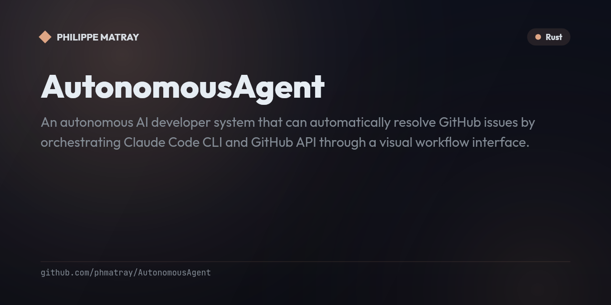

# Autonomous Agent

<!-- portfolio-badges:start -->
<!-- Identity -->
[](https://github.com/phmatray/AutonomousAgent)

[](https://github.com/phmatray/AutonomousAgent/stargazers)
[](https://github.com/phmatray/AutonomousAgent/network/members)

<!-- Activity -->
[](https://github.com/phmatray/AutonomousAgent/issues)
[](https://github.com/phmatray/AutonomousAgent/pulls)
[](https://github.com/phmatray/AutonomousAgent/commits)
<!-- portfolio-badges:end -->

<!-- portfolio-toc:start -->

## Table of Contents

- [Overview](#overview)
- [Technology Stack](#technology-stack)
- [Project Structure](#project-structure)
- [Getting Started](#getting-started)
- [Configuration](#configuration)
- [Architecture](#architecture)
- [Git Workflow](#git-workflow)
- [Development Roadmap](#development-roadmap)
- [License](#license)
- [Contributing](#contributing)

<!-- portfolio-toc:end -->


An autonomous AI developer system that can automatically resolve GitHub issues by orchestrating Claude Code CLI and GitHub API through a visual workflow interface.

## Overview

This project provides a desktop application (built with Tauri + React) similar to n8n that enables workflow automation for AI-powered development tasks. The system can autonomously:

1. Sync a configurable GitHub repository
2. Read issues from the repository
3. Plan solutions using Claude Code
4. Create git worktrees and branches
5. Apply solutions via Claude Code
6. Commit changes with conventional commits + gitmoji
7. Create pull requests

A pre-built "Autonomous Developer" workflow template is included that implements this full pipeline out of the box.

## Features

- **Visual workflow editor** — A drag-and-drop, DAG-based canvas (built on `@xyflow/react`) for composing automation pipelines out of GitHub, Git, Claude, and control-flow nodes.
- **Autonomous issue-to-PR pipeline** — The bundled "Autonomous Developer" template syncs a repo, reads issues, plans and applies a fix via Claude Code, commits with Conventional Commits + Gitmoji, and opens a pull request end to end.
- **13 workflow node types with template resolution** — GitHub (sync/read issues/create PR), Git (worktree/branch/commit), Claude (analyze/plan/apply), and control-flow (trigger/condition/loop/delay) nodes, wired together with `{{nodeId.field}}` references resolved at runtime.
- **Parallel DAG execution engine** — Workflow edges are topologically sorted (Kahn's algorithm) with cycle detection, grouping independent nodes into levels that execute in parallel, backed by an explicit state machine and configurable retry/backoff policies.
- **Workflow preflight validation** — Checks node configs, credentials, and template references before a run starts, surfacing node-level errors, warnings, and hints so broken workflows fail fast instead of mid-execution.
- **Backlog triage with issue scoring** — Syncs GitHub issues into a persistent backlog and ranks them by priority, triage status, impact, effort, and labels, generating a short human-readable rationale for what to automate next.
- **Live execution monitoring & debug bundles** — Streams Claude CLI stdout/stderr and node state in real time during a run, with an exportable JSON debug bundle (with optional credential-activity filters) for troubleshooting failures.
- **Secure credential storage with audit trail** — GitHub tokens and Claude credentials live in the OS keyring (Keychain/Credential Manager/Secret Service), auto-restore on startup, and every save/verify/delete action is recorded in a local, secret-redacted audit log.

## Technology Stack

### Frontend
- **React 19** + TypeScript (type-safe UI development)
- **Vite** (fast development server and builds)
- **@xyflow/react** (node-based workflow editor)
- **Tailwind CSS** (utility-first styling)
- **Zustand** (lightweight state management for workflow editor)
- **TanStack Query v5** (server state caching and mutations)

### Backend (Tauri/Rust)
- **Tauri v2** (secure native desktop app framework)
- **SQLx 0.8** + SQLite (workflow and execution persistence)
- **Octocrab 0.42** (GitHub API client)
- **git2-rs 0.19** (fast git operations)
- **tokio** (async runtime)
- **keyring 3.6** (OS keychain integration)
- **chrono** (datetime handling)

## Project Structure

```
autonomous-agent/
├── src/                          # React Frontend
│   ├── app/
│   │   └── routes/
│   │       ├── dashboard/        # DashboardPage - workflow overview
│   │       ├── editor/           # EditorPage - visual workflow editor
│   │       ├── monitoring/       # MonitoringPage - execution monitoring
│   │       └── settings/         # SettingsPage - authentication config
│   ├── features/
│   │   └── workflow-editor/
│   │       └── stores/           # Zustand editor store
│   ├── lib/
│   │   ├── api/                  # Tauri IPC wrappers
│   │   │   ├── github.ts         # GitHub commands
│   │   │   ├── workflow.ts       # Workflow CRUD + execution
│   │   │   └── claude.ts         # Claude execution + events
│   │   ├── hooks/
│   │   │   └── useClaudeExecution.ts  # Claude streaming hook
│   │   ├── templates/
│   │   │   └── autonomous-developer.ts  # Pre-built workflow
│   │   └── router/               # React router config
│   └── types/
│       └── workflow.ts           # Shared TypeScript types
│
├── src-tauri/                    # Rust Backend
│   ├── src/
│   │   ├── commands/             # Tauri command handlers
│   │   │   ├── github.rs         # GitHub API commands
│   │   │   ├── claude.rs         # Claude execution commands
│   │   │   ├── git.rs            # Git operation commands
│   │   │   └── workflow.rs       # Workflow CRUD + execution commands
│   │   ├── services/
│   │   │   ├── storage.rs        # OS keyring token storage
│   │   │   ├── github_client.rs  # Octocrab GitHub client
│   │   │   ├── claude_executor.rs # Claude CLI process manager
│   │   │   ├── git_service.rs    # git2 + CLI git operations
│   │   │   ├── mod.rs            # AppState (all services)
│   │   │   └── workflow_engine/
│   │   │       ├── mod.rs        # WorkflowEngine (CRUD, execution)
│   │   │       ├── executor.rs   # DAG builder + level executor
│   │   │       ├── node_registry.rs  # NodeExecutor trait + registry
│   │   │       ├── state_machine.rs  # Workflow/Node state transitions
│   │   │       ├── scheduler.rs  # Execution scheduler
│   │   │       └── nodes/        # Node type implementations
│   │   │           ├── github.rs # Sync, ReadIssues, CreatePR
│   │   │           ├── git.rs    # Worktree, Branch, Commit
│   │   │           ├── claude.rs # Plan, Apply, Analyze
│   │   │           └── control.rs # Trigger, Condition, Loop, Delay
│   │   ├── models/               # Data models
│   │   ├── db/                   # SQLite initialization
│   │   ├── errors/               # AppError types
│   │   └── main.rs               # App entry point
│   └── Cargo.toml
│
└── package.json
```

## Getting Started

### Prerequisites

- Node.js 18+ and npm
- Rust 1.75+
- Git
- Claude Code CLI (`claude`) installed and on PATH
- Linux only: Tauri system libraries (at minimum `glib-2.0` development headers)

On Debian/Ubuntu, install the common Tauri v2 Linux prerequisites with:

```bash
sudo apt-get update
sudo apt-get install -y libglib2.0-dev libgtk-3-dev libwebkit2gtk-4.1-dev libayatana-appindicator3-dev librsvg2-dev patchelf
```

### Installation

1. Clone the repository:
   ```bash
   git clone <repository-url>
   cd autonomous-agent
   ```

2. Install frontend dependencies:
   ```bash
   npm install
   ```

3. Install Rust dependencies (happens automatically on first build)

### Development

Run the development server:

```bash
npm run tauri:dev
```

This will start both the Vite dev server and the Tauri application.

### Building

Build the production application:

```bash
npm run tauri:build
```

The built application will be available in `src-tauri/target/release`.

### Running Tests

Run all local quality gates (Rust fmt/clippy + TypeScript typecheck + frontend tests):

```bash
npm run check
```

Run full local verification (quality gates + WebDriver smoke):

```bash
npm run test:all
```

Run the Rust test suite:

```bash
cd src-tauri && cargo test
```

Check TypeScript compilation:

```bash
npx tsc --noEmit
```

Run frontend end-to-end tests (Tauri WebDriver):

```bash
npm run test:e2e
```

Run the fast WebDriver smoke subset (used in CI):

```bash
npm run test:e2e:smoke
```

Run frontend coverage:

```bash
npm run test:coverage
```

Run Rust coverage (first-time setup + summary):

```bash
npm run coverage:rust:setup
npm run coverage:rust:summary
```

Generate Rust lcov output for Codecov-compatible reports:

```bash
npm run coverage:rust
```

Prerequisites:
- Google Chrome installed locally
- WebDriver dependencies installed via `npm install` (includes `selenium-webdriver`; browser drivers are resolved by Selenium Manager)

## Configuration

### GitHub Authentication

Navigate to **Settings** in the application and enter your GitHub Personal Access Token. The token is stored securely in your OS keyring (macOS Keychain, Windows Credential Manager, or Linux Secret Service).

Required token scopes: `repo`, `workflow`.

The application automatically restores your GitHub session on startup from the stored token.

### Monitoring UI

The monitoring route defaults to a high-signal execution view:

- Execution timeline and log stream stay visible by default.
- Verbose inspectors and debug bundle filter controls live under **Advanced diagnostics**.
- Debug bundle export remains available from the execution header.

## Architecture

For a detailed architecture overview, see [docs/ARCHITECTURE.md](docs/ARCHITECTURE.md).

### Tauri IPC Commands

The frontend communicates with the backend via Tauri's invoke system. The app currently exposes 43 registered commands:

| Category | Command | Description |
|----------|---------|-------------|
| **Workflow** | `list_workflows` | List all saved workflows |
| | `get_workflow` | Get workflow by ID |
| | `create_workflow` | Create new workflow |
| | `update_workflow` | Update existing workflow |
| | `delete_workflow` | Delete workflow |
| | `preflight_workflow` | Validate workflow before execution |
| | `execute_workflow` | Execute a workflow |
| | `cancel_workflow_execution` | Cancel a running execution |
| | `list_executions` | List execution history |
| | `get_execution_logs` | Get logs for an execution |
| | `copy_debug_bundle` | Export execution debug bundle with optional credential-activity filters |
| **GitHub** | `authenticate_github` | Authenticate with token |
| | `list_github_credentials` | List saved GitHub credential entries |
| | `list_repositories` | List user repositories |
| | `list_issues` | List repository issues |
| | `create_pull_request` | Create a PR |
| | `get_auth_status` | Check authentication status |
| | `get_saved_github_token` | Read saved token for credentials UI restore |
| | `delete_github_token` | Remove all saved GitHub credentials |
| | `delete_github_credential` | Remove a specific saved GitHub credential profile |
| | `verify_github_token` | Validate token before revealing restored secrets |
| | `list_credential_audit_events` | List local credential audit events |
| **Claude** | `execute_plan` | Run Claude CLI prompt |
| | `cancel_execution` | Cancel running execution |
| | `list_running_executions` | List active executions |
| | `get_claude_credential_status` | Read Claude credential configuration status |
| | `save_claude_credential` | Save Claude API key and optional account label |
| **Git** | `git_status` | Repository status |
| | `git_log` | Commit history |
| | `git_diff` | Diff summary |
| | `git_create_worktree` | Create worktree |
| | `git_list_worktrees` | List worktrees |
| | `git_remove_worktree` | Remove worktree |
| | `git_commit` | Stage all and commit |
| | `git_push` | Push to remote |
| | `git_pull` | Pull from remote |
| | `git_clone` | Clone repository |
| **Backlog** | `list_backlog_items` | List backlog items |
| | `sync_github_issues_to_backlog` | Sync GitHub issues into backlog |
| | `link_backlog_to_workflow` | Link a backlog item to a workflow |
| | `create_linked_workflow_from_backlog` | Create a workflow linked to a backlog item |
| | `delete_backlog_item` | Delete backlog item |
| **System** | `is_initialized` | Check app initialization status |

### Workflow Nodes

13 node types organized into 4 categories:

Detailed standardized node documentation is available in [docs/nodes/README.md](docs/nodes/README.md).
Editor node feature files are organized in [src/features/workflow-editor/nodes/README.md](src/features/workflow-editor/nodes/README.md).

**GitHub Nodes:**
- `github.sync` - Clone or pull a repository
- `github.readIssues` - Fetch open issues from a repository
- `github.createPR` - Create a pull request

**Git Nodes:**
- `git.worktree` - Create a git worktree with a new branch
- `git.branch` - Create or checkout a branch
- `git.commit` - Stage all changes and commit with conventional commit format

**Claude Nodes:**
- `claude.analyze` - Analyze code or issue context
- `claude.plan` - Generate an implementation plan for an issue
- `claude.apply` - Execute a plan by running Claude CLI in a working directory

**Control Flow:**
- `trigger` - Start a workflow (manual or scheduled)
- `condition` - Branch execution based on a condition (supports `exists`, `not_empty`, `eq`, `neq`, `gt`, `lt`, `gte`, `lte`)
- `loop` - Iterate over an array, executing downstream nodes for each item
- `delay` - Wait for a specified duration

### Workflow Execution Engine

The workflow engine uses a **DAG (Directed Acyclic Graph)** executor:

1. **DAG Construction**: Builds a dependency graph from workflow edges using topological sort (Kahn's algorithm) with cycle detection
2. **Level Execution**: Nodes are grouped into levels where all nodes in a level can execute in parallel
3. **Template Resolution**: Node configs use `{{nodeId.field}}` references that are resolved from previous node outputs at runtime
4. **State Machine**: Workflows and nodes follow a state machine: `IDLE -> SCHEDULED -> RUNNING -> COMPLETED/FAILED/CANCELLED`
5. **Retry Policy**: Configurable retry with linear or exponential backoff

### Database Schema

SQLite database with 5 tables:

- `workflows` - Workflow definitions (nodes, edges, config stored as JSON)
- `executions` - Workflow execution history with status tracking
- `execution_logs` - Timestamped log entries per execution
- `node_executions` - Individual node execution state, input/output, retry count
- `config` - Key-value application configuration

### Security

- GitHub tokens stored securely in OS keyring (macOS Keychain, Windows Credential Manager)
- Automatic session restoration from keyring on startup
- Token retrieval to the frontend is limited to the Credentials page restore flow
- Local credential audit stream stores metadata only (no secret values) and redacts token-like substrings
- Input validation on all Tauri commands
- Claude CLI runs in subprocess with configurable timeout

## Git Workflow

This project follows the **Gitflow** branching model:

- `main` - Production-ready code
- `develop` - Integration branch for features
- `feature/*` - Feature branches
- `hotfix/*` - Hotfix branches
- `release/*` - Release branches

### Commit Convention

We use **Conventional Commits** with **Gitmoji**:

```
{gitmoji} {type}({scope}): {description}

Example: ✨ feat(auth): add OAuth integration
```

Supported types and their gitmoji:
| Type | Gitmoji | Description |
|------|---------|-------------|
| `feat` | ✨ | New feature |
| `fix` | 🐛 | Bug fix |
| `docs` | 📝 | Documentation |
| `style` | 💄 | Code style |
| `refactor` | ♻️ | Code refactoring |
| `perf` | ⚡ | Performance |
| `test` | ✅ | Tests |
| `build` | 🏗️ | Build system |
| `ci` | 👷 | CI/CD |
| `chore` | 🔧 | Chores |

## Development Roadmap

- [x] Phase 1: Project Scaffold
- [x] Phase 2: Backend Services (storage, GitHub client, Claude executor, Git service)
- [x] Phase 3: Workflow Engine (DAG executor, node registry, state machine, 13 node types)
- [x] Phase 4: React UI (dashboard, editor, monitoring, settings)
- [x] Phase 5: Integration & Testing (API alignment, test suites, documentation)

## License

MIT

## Contributing

Contributions are welcome! Please follow the git workflow and commit conventions outlined above.
